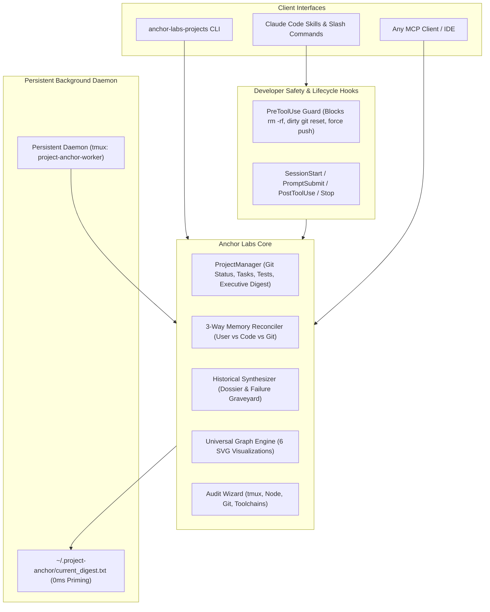

# Anchor-Labs-Projects ⚓

> **Universal Software Project Anchor, Memory OS, Git Tracker & Visualizer for AI Agents & Developers**

Anchor-Labs-Projects is a general-purpose, persistent project management and memory operating system designed for human developers and autonomous AI coding agents (such as Claude Code, Antigravity, and MCP clients).

It eliminates context drift, prevents destructive accidental commands, reconciles fuzzy memories against ground-truth git history, tracks tasks and test suites, and renders high-contrast, accessibility-compliant project visualizations.

---

## 🏛️ System Architecture



---

## ✨ Key Capabilities

1. **Deterministic Executive Digest (~300 tokens)**: Instant session priming containing active focus, milestone, git branch cleanliness, last commit, open tasks, and latest test suite results.
2. **3-Way Memory Reconciler ("Does that sound familiar?")**: Compares what a developer or agent recalls against what is actually implemented and the git commit log explaining when and why it changed.
3. **Developer Safety Guards (`on-pre-tool.js`)**:
   - Blocks `git reset --hard` when uncommitted working changes exist.
   - Blocks destructive deletions (`rm -rf /`, `.git` wipeouts).
   - Blocks force-pushes (`git push --force` or `-f`) to `main` / `master`.
4. **Universal High-Contrast Graph Engine**:
   - Renders clean, standalone SVG charts with high chromatic contrast against slate dark backgrounds.
   - Intelligently infers optimal chart types: Test Execution Trends, Sprint Burndown, Task Distribution, Performance Benchmarks, Module Metrics, and Engineering Capability Radars.
   - Strictly focuses on data with zero intrusive color theory meta-text on the charts.
5. **Historical Synthesizer & Failure Graveyard**: Scans git commit logs and past session transcripts to catalog architectural decisions (`PROJECT_DOSSIER.md`) and prevent recurring traps (`FAILURE_GRAVEYARD.md`).
6. **Persistent Background Daemon (`project-anchor-worker`)**: Runs inside a dedicated tmux session to track git events, record test results, and refresh the instant session cache.
7. **Toolchain & CLI Discovery Engine (Game Dev Ready)**:
   - Automatically scans repositories for build scripts (`CMakeLists.txt`, `Makefile`, `package.json`), custom executables (`tools/`, `scripts/`, `bin/`), and argument usages.
   - Built-in **Game Dev Asset Pipeline Detector**: Identifies game models/shapes (`.dts`, `.dae`, `.gltf`), interiors and maps (`.dif`, `.mis`, `.ter`), textures (`.dds`, `.png`), scripts (`TorqueScript` / `.cs`), and audio assets (specifically tailored for classic game conversions like Tribes 2 / Torque Engine porting).
   - Dynamic custom command registry: Add or remove project CLI tools as your test and build requirements evolve.

---

## 📋 Recommended Setup: CLAUDE.md

This repository includes a battle-tested [`CLAUDE.md`](CLAUDE.md) designed to enforce engineering discipline, prevent hallucinations, block collateral kills of running processes, and stop AI agents from hand-rolling brittle scripts.

> **Recommended**: Copy this repository's [`CLAUDE.md`](CLAUDE.md) directly into your project's root directory (or append its guardrails to your existing `CLAUDE.md`):
> ```bash
> cp path/to/Anchor-Labs-Projects/CLAUDE.md /path/to/your-project/CLAUDE.md
> ```
> Claude Code will automatically detect it and adhere to these strict guardrails on any project.

## 🚀 Quick Start & Installation

```bash
# Clone the repository
git clone https://github.com/CodeMasterCody3D/Anchor-Labs-Projects.git
cd Anchor-Labs-Projects

# Run the installation wizard
./install.sh
```

The installer:
- Verifies Node.js and `tmux` availability.
- Symlinks `anchor-labs-projects` and `project-anchor` CLI into `~/.local/bin/`.
- Registers Claude Code skills and slash commands in `~/.claude/skills/project-anchor/`.
- Runs a full environment diagnostic audit.

---

## 🛠️ CLI Commands (`anchor-labs-projects` / `project-anchor`)

| Command | Description |
|---|---|
| `anchor-labs-projects doctor` | Audits Node.js, tmux daemon, Git repository, and build toolchains |
| `anchor-labs-projects status` | Displays full project snapshot and executive digest |
| `anchor-labs-projects check` | Audits supervisor governance, historical scan progress, and background subagents |
| `anchor-labs-projects focus "<focus>" [milestone]` | Updates active project focus and milestone |
| `anchor-labs-projects tasks [status]` | Lists project tasks (filters: `all`, `todo`, `in_progress`, `completed`) |
| `anchor-labs-projects task add "<title>" [pri]` | Adds new task (`low`, `medium`, `high`, `critical`) |
| `anchor-labs-projects task done <task-id>` | Marks task completed (e.g. `T-2`) |
| `anchor-labs-projects test record <passed> <failed> [cov%]` | Records test run in project test ledger |
| `anchor-labs-projects graph [type] [title]` | Generates SVG visualization (`test_trend`, `burndown`, `task_distribution`, `benchmark`, `module_metrics`, `radar`) |
| `anchor-labs-projects reconcile "<memory>" [file]` | 3-way delta verification (User vs Code vs Git history) |
| `anchor-labs-projects scan` | Scans commits and transcripts into `PROJECT_DOSSIER.md` & `FAILURE_GRAVEYARD.md` |
| `anchor-labs-projects sweep <query>` | Greps past session transcripts for solutions and discussions |
| `anchor-labs-projects tools` | Scans repository for CLI tools, converters, build scripts, and game dev pipelines |
| `anchor-labs-projects tool add <name> <cmd> [desc]` | Registers a custom command, converter, or helper shortcut |
| `anchor-labs-projects tool remove <name>` | Removes an obsolete command from project registry |
| `anchor-labs-projects handoff [notes]` | Generates morning handoff card for seamless next-session resumption |
| `anchor-labs-projects daemon start|status|attach|stop` | Controls persistent tmux background watcher |

*(Note: `project-anchor` is also available as a shorthand alias)*

---

## 💬 Claude Code Slash Commands

Anchor-Labs-Projects registers dedicated, collision-free slash commands for Claude Code:

- `/panchor`: Displays project state, git branch, task breakdown, and test health.
- `/ptools`: Scans project toolchain, CLI commands, asset pipelines (Tribes/Torque formats: DTS, DIF, TER, CS), and build targets (alias `/pcli`).
- `/ptask [list|add|done]`: Manages project task registry directly from chat.
- `/pscan`: Runs the architectural scanner and catalogs failure traps.
- `/psweep <query>`: Deep transcript search for previous solutions.
- `/pgraph [type]`: Generates high-contrast project visualizations.
- `/preconcile "<memory>" [file]`: Runs 3-way delta verification when assumptions feel outdated.
- `/phandoff [notes]`: Formulates morning handoff card before closing a session.
- `/pcheck`: Audits project supervisor governance, historical scan progress, and subagents (alias `/panchorcheck`).
- `/phelp`: Displays full command cheat sheet.

---

## 🔌 Universal MCP Server (`anchor-labs-projects`)

Anchor-Labs-Projects includes a Model Context Protocol (MCP) server exposing 17 tools:

```json
{
  "mcpServers": {
    "anchor-labs-projects": {
      "command": "node",
      "args": ["/home/cody/Anchor-Labs-Projects/server/mcp-server.js"]
    }
  }
}
```

### Available MCP Tools:
1. `project_get_state`: Full project snapshot.
2. `project_digest`: Compact ~300-token executive digest.
3. `project_set_focus`: Update active focus & milestone.
4. `project_task_add`: Add task with priority and category.
5. `project_task_list`: Query tasks with optional status filter.
6. `project_task_complete`: Mark task complete.
7. `project_record_test`: Record test suite metrics.
8. `project_reconcile`: 3-way memory delta reconciliation.
9. `project_scan_history`: Synthesize dossier and failure graveyard.
10. `project_sweep_transcripts`: Grep past session transcripts.
11. `project_generate_graph`: Render SVG charts.
12. `project_audit`: Run dependency and toolchain audit.
13. `project_handoff`: Generate end-of-session handoff card.
14. `project_check`: Audit supervisor governance invariants, scan progress, and subagents.

---

## 🎨 Visualization Gallery & Color Theory

Visualizations are generated as standards-compliant SVG documents configured for dark theme IDEs and Markdown previewers:
- **Base Canvas**: Slate dark (`#0f172a` canvas, `#1e293b` cards, `#334155` borders).
- **Legibility**: Perceptually separated text luminance (`#f8fafc` titles, `#94a3b8` axis labels).
- **Data Accents**: High-contrast, colorblind-safe categorical series (Cyan `#38bdf8`, Emerald `#34d399`, Rose `#fb7185`, Amber `#fbbf24`, Violet `#a78bfa`).
- **Focus**: Purely data-driven with no intrusive meta-annotations.

---

## 📄 License

MIT License. Designed and maintained by [@CodeMasterCody3D](https://github.com/CodeMasterCody3D).
